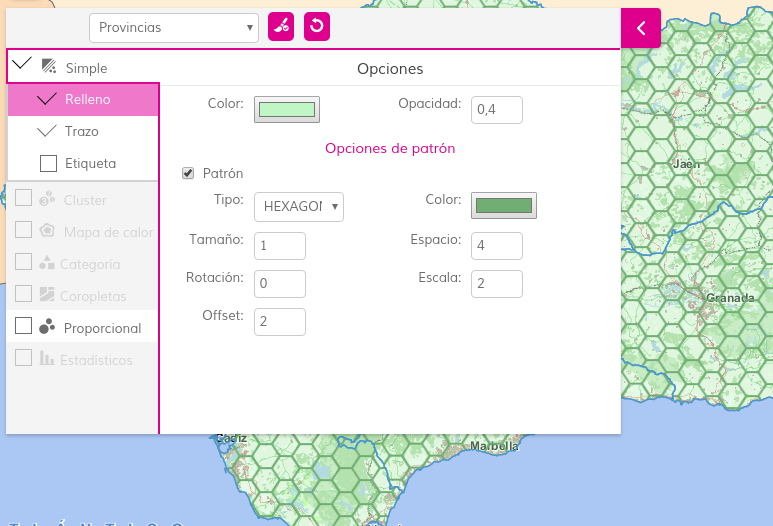
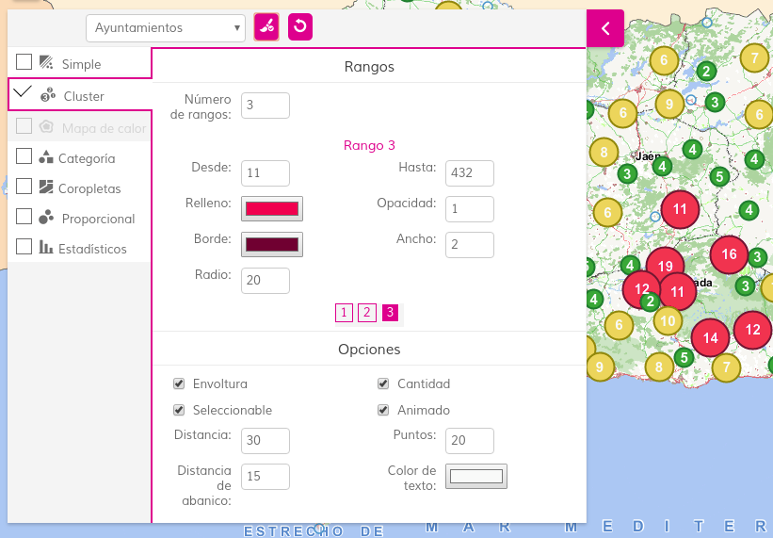

# style-manager 

[](https://github.com/sigcorporativo-ja/Mapea4-dev-webpack)  

## Descripción

 Plugin de [Mapea](https://github.com/sigcorporativo-ja/Mapea4) para la gestión de la simbología de las capas vectoriales del mapa. 
 
 Los tipos de simbología soportada son: simple ([polígono](https://github.com/sigcorporativo-ja/Mapea4/wiki/M.style.Polygon), [línea](https://github.com/sigcorporativo-ja/Mapea4/wiki/M.style.Line), [punto](https://github.com/sigcorporativo-ja/Mapea4/wiki/M.style.Point)), [coropletas](https://github.com/sigcorporativo-ja/Mapea4/wiki/Coropletas), [símbolos proporcionales](https://github.com/sigcorporativo-ja/Mapea4/wiki/Proporcional), [categorías](https://github.com/sigcorporativo-ja/Mapea4/wiki/Categor%C3%ADas), [estadísticos](https://github.com/sigcorporativo-ja/Mapea4/wiki/Estad%C3%ADsticos), [cluster](https://github.com/sigcorporativo-ja/Mapea4/wiki/Cluster) y [mapas de calor](https://github.com/sigcorporativo-ja/Mapea4/wiki/Heatmap). La capa a modificar se selecciona desde el propio plugin, que mantendrá activos únicamente los tipos de simbología compatibles con la capa según su geometría.  

  
 
 La simbología puede ser [Compuesta](https://github.com/sigcorporativo-ja/Mapea4/wiki/Composite), y a medida que se van aplicando simbologías concretas, la interfaz desactiva las que no son compatibles.  

 

En dispositivos móviles, la interfaz se adaptará para ocupar la pantalla completa.

## Recursos y uso

- js: stylemanager.ol.js
- css: stylemanager.min.css

Parámetro | Descripción 
--- | --- |
**layer** | M.layer.Vector - _opcional_ - Capa pre seleccionada.<br> Si no tiene o no ha cargado aún sus features, lanzará un error.  

Ejemplos:

```javascript
// Creación por defecto
var mp = new M.plugin.StyleManager();
myMap.addPlugin(mp);
```  
```javascript
// Inicialización con capa
capaVectorial.on(M.evt.LOAD, function() {
     var mp = new M.plugin.StyleManager(capaVectorial);
     myMap.addPlugin(mp);
});
```  
